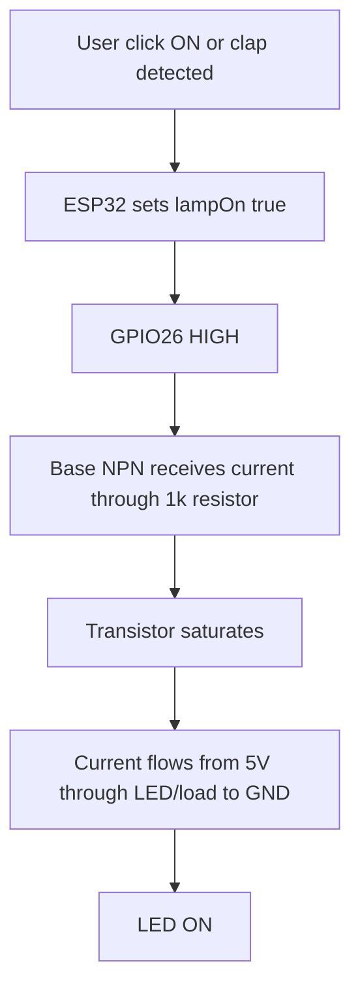
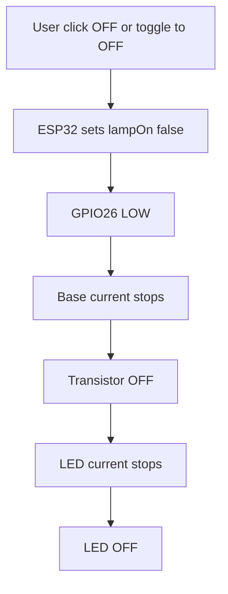

# 5V LED Migration Guide

## Ringkasan Keputusan

Arah 5V DC sudah diterima sebagai implementasi utama project. Ini lebih cocok untuk target mobile, aman, ringan, dan mudah dirakit ulang. Fitur software tetap dipertahankan karena dashboard, API, clap detection, threshold, dan monitoring sensor tidak bergantung pada lampu AC.

Status saat ini:

- Firmware memakai output LED 5V aktif HIGH di GPIO26.
- Relay dan lampu AC diganti dengan LED 5V yang disaklar transistor NPN.
- Jangan menggabungkan wiring relay AC dan wiring LED 5V dalam satu rakitan.

## Apakah Semua Fitur Bisa Tetap Ada?

Ya, hampir semua fitur bisa tetap dipertahankan.

| Fitur | Status Setelah Migrasi 5V | Catatan |
| --- | --- | --- |
| Dashboard web lokal | Tetap | Teks dashboard sudah diarahkan ke LED 5V |
| Status lampu ON/OFF | Tetap | State `lampOn` tetap relevan |
| Tombol ON, OFF, TOGGLE | Tetap | Endpoint dan perilaku bisa sama |
| Clap mode | Tetap | Sensor KY-037 dan algoritma threshold tidak berubah |
| Slider threshold | Tetap | Nilai ADC tetap 0 sampai 4095 |
| Monitoring AO KY-037 | Tetap | GPIO34 tetap cocok untuk input analog |
| Monitoring DO KY-037 | Tetap | GPIO27 tetap bisa dipakai untuk observasi |
| WiFi reconnect | Tetap | Tidak terkait relay atau LED |
| Endpoint JSON | Tetap | Kontrak API bisa tetap sama |
| Cooldown anti double trigger | Tetap | Tidak terkait output fisik |
| Lampu AC PLN | Diganti | Output menjadi LED 5V DC |
| Relay aktif LOW | Diganti | Output menjadi transistor aktif HIGH |

Kesimpulan: fitur user-facing tetap, dan firmware output sekarang mengikuti aktif HIGH.

## Worth atau Tidak?

Untuk project ini, migrasi 5V LED lebih worth daripada tetap memakai PLN jika targetnya demo, belajar IoT, rakitan meja, portable prototype, atau perangkat yang sering dipindah.

Alasan worth:

- Tidak ada tegangan AC 220V di breadboard atau kabel eksperimen.
- Satu kabel USB bisa menyalakan ESP32, sensor, dan LED.
- Rangkaian lebih ringan dan mudah dibawa.
- Risiko wiring turun drastis karena tidak ada fitting, steker, dan jalur live PLN.
- Tidak perlu relay coil yang boros arus dan berbunyi klik.
- Transistor switching lebih cepat, senyap, dan cocok untuk LED kecil.
- Debug lebih aman karena seluruh rangkaian berada di 5V DC.

Kapan tidak worth:

- Jika tujuannya benar-benar mengontrol lampu ruangan 220V.
- Jika LED strip yang dipakai panjang dan butuh arus besar.
- Jika output harus sangat terang seperti lampu utama.
- Jika USB source tidak cukup kuat untuk ESP32 plus LED load.

Rekomendasi praktis: gunakan 5V LED untuk versi utama. Untuk versi yang ingin menyalakan lampu rumah sungguhan, buat varian terpisah dengan relay/SSR/enclosure yang benar, jangan dicampur dengan prototype breadboard.

## Komponen Yang Dibuang

| Komponen Lama | Status | Alasan |
| --- | --- | --- |
| Lampu bohlam AC 7 W | Dibuang | Tidak lagi memakai PLN |
| Fitting lampu | Dibuang | Tidak ada bohlam AC |
| Steker dan kabel AC 220V | Dibuang | Sumber daya menjadi USB 5V |
| Modul relay 5V | Dibuang | Diganti transistor sebagai saklar elektronik |

## Komponen Yang Ditambah

| Komponen Baru | Fungsi | Catatan |
| --- | --- | --- |
| LED 5V satuan atau strip pendek | Output lampu | Pilih sesuai kebutuhan terang dan arus |
| Transistor NPN 2N2222 atau S8050 | Saklar low-side | Untuk LED kecil sampai strip pendek berarus rendah |
| Resistor 1k ohm | Pembatas arus base | Dipasang antara GPIO26 dan base transistor |
| Resistor 220 ohm | Pembatas arus LED satuan | Wajib untuk LED bare tanpa resistor bawaan |
| Kabel jumper | Wiring | Gunakan kabel rapi dan pendek di breadboard |

Komponen opsional tetapi bagus:

| Komponen Opsional | Fungsi |
| --- | --- |
| Resistor 100k ohm base ke GND | Membantu transistor tetap OFF saat ESP32 boot/reset |
| Logic-level N-MOSFET | Lebih cocok untuk LED strip yang arusnya lebih besar |
| USB power bank 5V 1A atau 2A | Membuat sistem benar-benar portable |
| Sekring kecil atau modul proteksi USB | Membatasi risiko short pada jalur 5V |

## Batas Arus dan Daya

Satu sumber USB bukan berarti arusnya tidak terbatas. Batas aman ditentukan oleh kemampuan port USB, kabel USB, jalur 5V board ESP32, transistor, resistor, dan LED.

Perkiraan konsumsi:

| Beban | Perkiraan Arus |
| --- | --- |
| ESP32 DevKit V1 dengan WiFi | sekitar 150 sampai 350 mA, bisa spike lebih tinggi |
| KY-037 | sekitar beberapa mA sampai belasan mA |
| LED merah satuan dengan resistor 220 ohm | sekitar 10 sampai 15 mA |
| LED strip 5V pendek | tergantung jumlah LED, bisa puluhan sampai ratusan mA |

Aturan praktis:

- Single LED aman untuk USB biasa.
- Beberapa LED kecil masih masuk akal jika total arus rendah.
- LED strip panjang tidak disarankan lewat breadboard dan pin 5V board kecil.
- Jangan pernah menyalakan LED langsung dari GPIO ESP32.
- GPIO hanya memberi sinyal ke base transistor, bukan memberi daya utama LED.

Untuk LED satuan, arus resistor kira-kira:

```text
I = (5V - V_LED - V_CE_sat) / R
```

Contoh LED merah:

```text
I = (5V - 2V - 0.2V) / 220 ohm
I sekitar 12.7 mA
```

Nilai ini cocok untuk LED indikator atau lampu kecil. Untuk LED putih/biru, arus bisa lebih kecil karena tegangan LED lebih tinggi.

## Wiring NPN Low-Side Switch

Gunakan transistor NPN sebagai saklar di sisi ground. Ini membuat GPIO ESP32 hanya mengendalikan base transistor.

### Pin Utama

| Bagian | Koneksi |
| --- | --- |
| ESP32 5V atau VIN | Rail 5V breadboard |
| ESP32 GND | Rail GND breadboard |
| KY-037 VCC | 3V3 atau 5V sesuai modul |
| KY-037 GND | GND bersama |
| KY-037 AO | GPIO34 |
| KY-037 DO | GPIO27 |
| GPIO26 | Resistor 1k ohm ke base transistor |
| Emitter NPN | GND bersama |
| Collector NPN | Sisi negatif LED/load |
| Sisi positif LED/load | 5V melalui resistor atau input 5V strip |

### Untuk LED Satuan

Rangkaian:

```text
5V USB
  |
  |-- resistor 220 ohm -- anode LED
                            cathode LED -- collector NPN
                                           emitter NPN -- GND

GPIO26 -- resistor 1k ohm -- base NPN
```

Catatan:

- Kaki panjang LED biasanya anode.
- Kaki pendek LED biasanya cathode.
- Resistor 220 ohm dipasang seri dengan LED.
- Jika memakai beberapa LED paralel, idealnya setiap LED punya resistor sendiri.

### Untuk LED Strip 5V

Rangkaian umum:

```text
5V USB rail -- LED strip +5V
LED strip GND/negative -- collector NPN
emitter NPN -- GND rail

GPIO26 -- resistor 1k ohm -- base NPN
```

Catatan penting:

- Banyak LED strip 5V sudah punya resistor atau driver bawaan. Jangan otomatis menambahkan resistor 220 ohm seri untuk seluruh strip jika strip sudah didesain untuk 5V.
- Pastikan total arus strip masih aman untuk USB source dan transistor.
- Untuk strip yang lebih terang atau panjang, ganti NPN dengan logic-level N-MOSFET.

## Common Ground Wajib

Semua bagian harus punya ground bersama:

```text
ESP32 GND = KY-037 GND = emitter transistor = USB 5V ground
```

Tanpa common ground, sinyal GPIO26 tidak punya referensi yang benar untuk menyalakan transistor.

## Perubahan Firmware Yang Diperlukan

Firmware memakai output LED aktif HIGH:

```cpp
const uint8_t LAMP_SWITCH_PIN = 26;
const uint8_t LAMP_ON_LEVEL = HIGH;
const uint8_t LAMP_OFF_LEVEL = LOW;
```

Fungsi output juga perlu mengikuti nama baru:

```cpp
void applyLampOutput()
{
  digitalWrite(LAMP_SWITCH_PIN, lampOn ? LAMP_ON_LEVEL : LAMP_OFF_LEVEL);
}
```

Di `setup()`:

```cpp
pinMode(LAMP_SWITCH_PIN, OUTPUT);
setLamp(false);
```

Endpoint API tidak harus berubah.

## Flow Setelah Migrasi



Untuk OFF:



## Urutan Migrasi Yang Aman

1. Lepas semua komponen AC: bohlam, fitting, steker, kabel AC, dan relay.
2. Siapkan rail 5V dan GND dari USB ESP32 di breadboard.
3. Sambungkan KY-037 seperti sebelumnya.
4. Rakit LED dan transistor dalam kondisi ESP32 tidak tersambung USB.
5. Cek ulang orientasi transistor dari datasheet komponen yang dipakai.
6. Cek ulang orientasi LED.
7. Upload firmware aktif HIGH.
8. Nyalakan dari USB.
9. Uji perintah OFF lebih dulu, LED harus mati.
10. Uji perintah ON, LED harus menyala.
11. Uji TOGGLE dan clap mode.
12. Jika transistor panas atau ESP32 reset, matikan dan kurangi beban LED.

## Validasi Setelah Migrasi

| Check | Expected Result |
| --- | --- |
| Boot pertama | LED tetap OFF setelah `setLamp(false)` |
| `/api/off` | GPIO26 LOW, LED OFF |
| `/api/on` | GPIO26 HIGH, LED ON |
| `/api/toggle` | LED berubah state |
| Clap mode ON | Tepuk tangan toggle LED satu kali |
| Clap mode OFF | Tepuk tangan tidak mengubah LED |
| Threshold rendah/tinggi | Sensitivitas berubah sesuai slider |
| Serial Monitor | Tidak reset berulang saat LED ON |
| Transistor | Tidak panas berlebihan |
| USB voltage | Tidak drop besar saat LED ON |

## Troubleshooting Migrasi

### LED Selalu Mati

Kemungkinan:

- Firmware lama yang masih aktif LOW belum ter-upload ulang.
- Base transistor tidak menerima sinyal karena resistor salah jalur.
- Collector dan emitter tertukar.
- LED terbalik.
- Ground tidak common.

Langkah:

1. Pastikan firmware memakai `HIGH` untuk ON.
2. Ukur GPIO26 saat ON jika ada multimeter.
3. Cek datasheet 2N2222 atau S8050 karena urutan kaki bisa berbeda antar package.
4. Cek LED dengan rangkaian resistor langsung ke 5V dan GND.

### LED Selalu Menyala

Kemungkinan:

- Collector/emitter tertukar.
- Base floating saat boot.
- Ada wiring bypass langsung dari LED ke GND.
- Firmware masih menganggap OFF sebagai `HIGH`.

Langkah:

1. Pastikan OFF adalah `LOW`.
2. Tambahkan resistor 100k ohm dari base ke GND jika perlu.
3. Cek ulang breadboard row yang tersambung.

### ESP32 Reset Saat LED Menyala

Kemungkinan:

- LED strip menarik arus terlalu besar.
- USB cable atau power bank tidak kuat.
- Jalur 5V board drop.
- Breadboard atau kabel jumper tidak cocok untuk arus strip.

Langkah:

1. Uji dengan satu LED kecil dulu.
2. Kurangi brightness atau panjang strip.
3. Pakai USB supply lebih kuat.
4. Untuk strip besar, gunakan jalur power terpisah dari supply 5V yang sama dan common ground.
5. Pertimbangkan logic-level N-MOSFET.

### Transistor Panas

Kemungkinan:

- Arus LED terlalu besar untuk 2N2222/S8050.
- Base drive kurang sehingga transistor tidak saturasi penuh.
- Beban strip terlalu besar untuk NPN kecil.

Langkah:

1. Turunkan arus LED.
2. Pakai LED lebih sedikit.
3. Pakai MOSFET logic-level untuk beban lebih besar.
4. Jangan lanjutkan pengujian jika komponen panas.

## Keputusan Final

ClapControl memakai arah:

```text
ESP32 + KY-037 + transistor NPN/MOSFET + LED 5V + satu sumber USB
```

Fitur software yang sudah ada dipertahankan, sedangkan istilah dan polaritas output mengikuti LED 5V active HIGH. Ini lebih cocok untuk demo IoT, lebih aman untuk dirakit di meja, dan lebih masuk akal jika project harus mobile.
