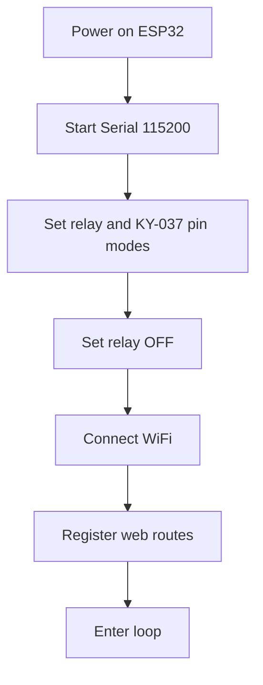
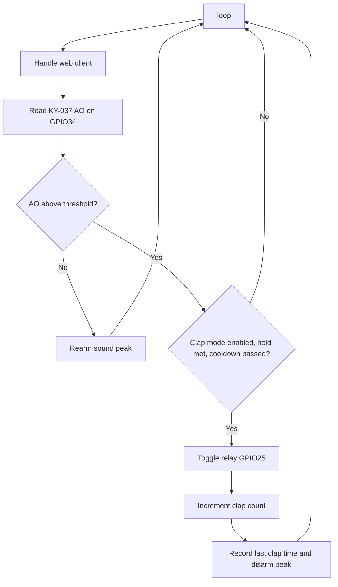
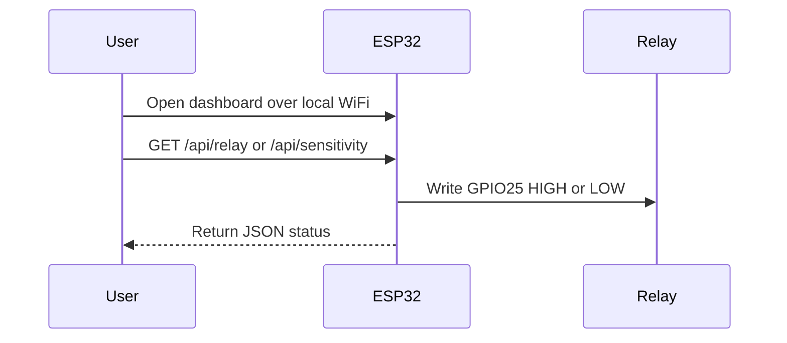

# Flow Overview

## Boot Flow

## Main Loop Flow

## Web Control Flow

## Clap Detection Rules

1. Read KY-037 AO from GPIO34.
2. Treat values at or above the web threshold as active sound.
3. Require the active signal to hold for `minActiveMs`.
4. Rearm only after the analog value drops below threshold.
5. Ignore triggers inside the configured cooldown window.
6. Toggle relay GPIO25 after a valid clap.
