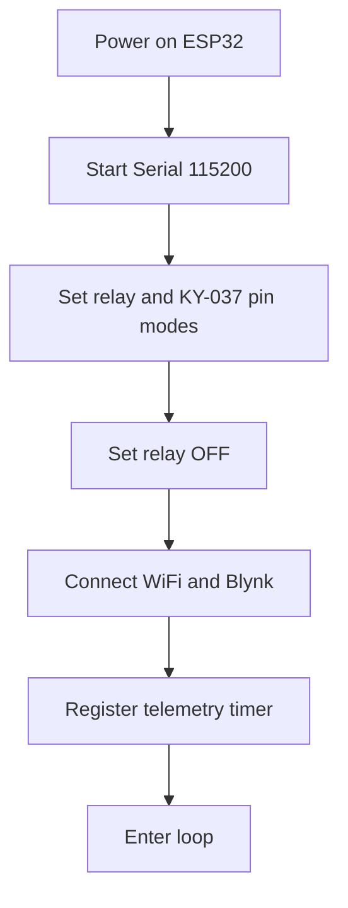
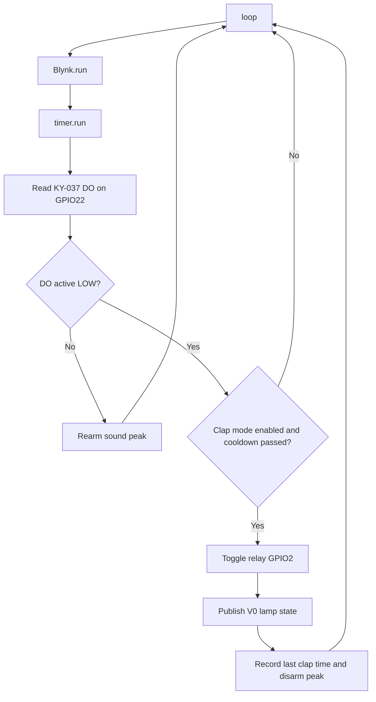
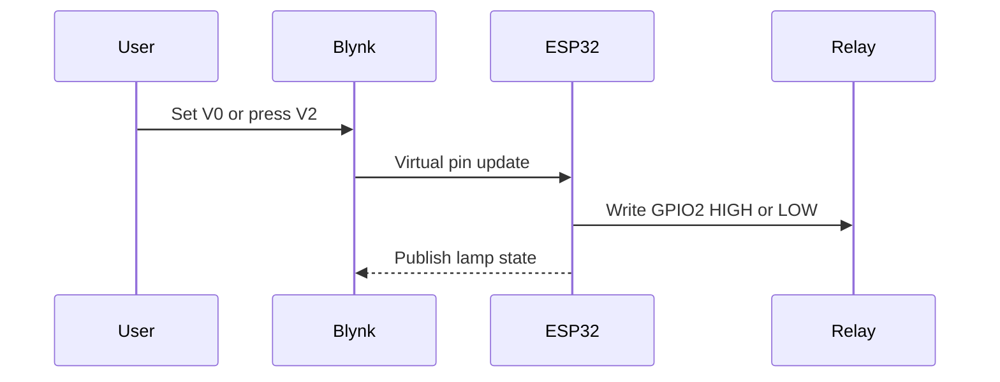

# Flow Overview

## Boot Flow

## Main Loop Flow

## Blynk Control Flow

## Clap Detection Rules

1. Read KY-037 DO from GPIO22.
2. Treat `LOW` as sound detected.
3. Rearm only after DO returns inactive.
4. Ignore triggers inside the `650 ms` cooldown window.
5. Toggle relay GPIO2 after a valid clap.
6. Publish the new relay state to Blynk.
