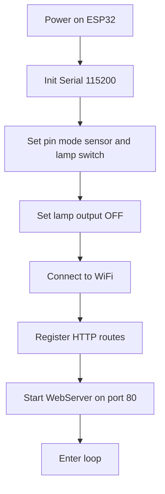
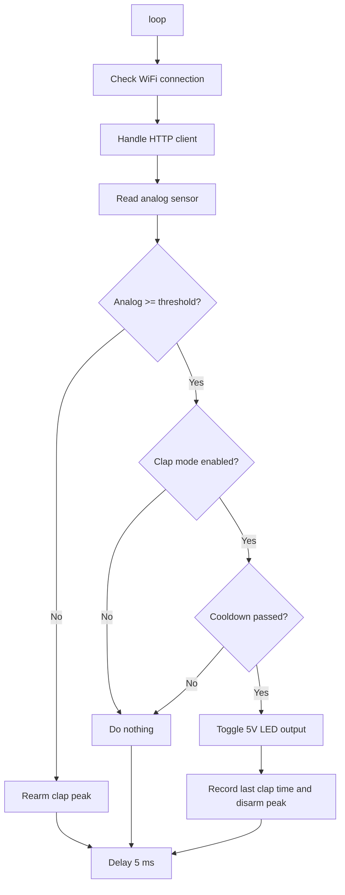
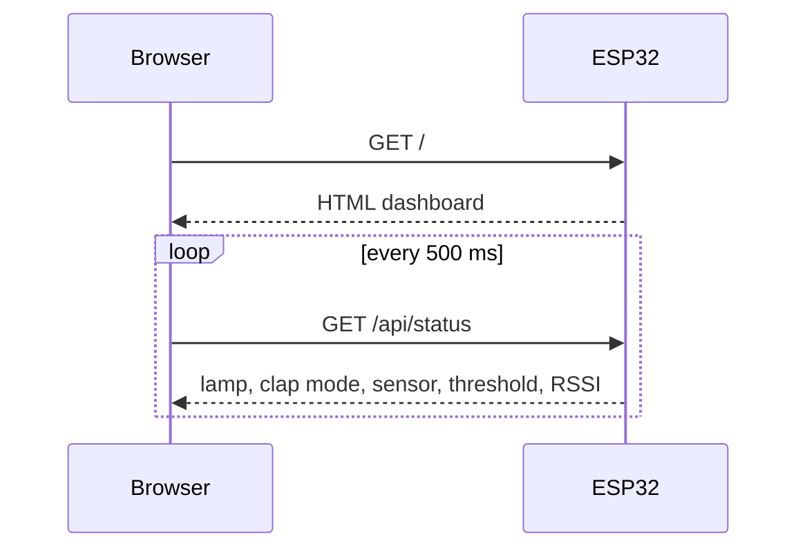
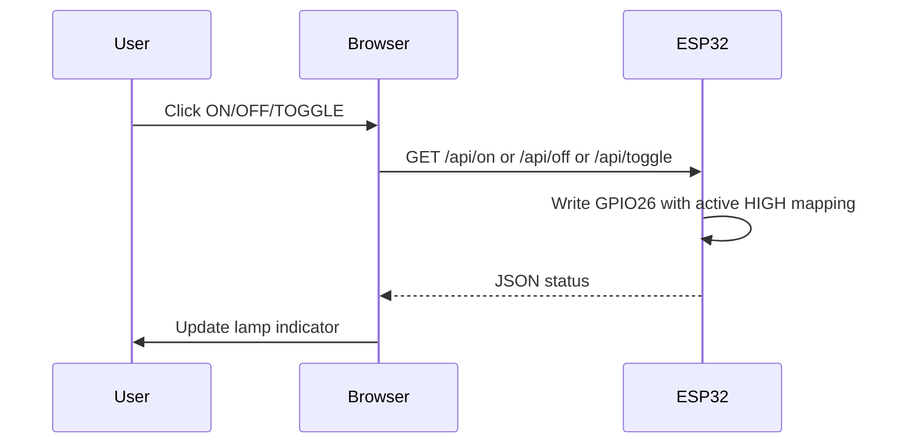
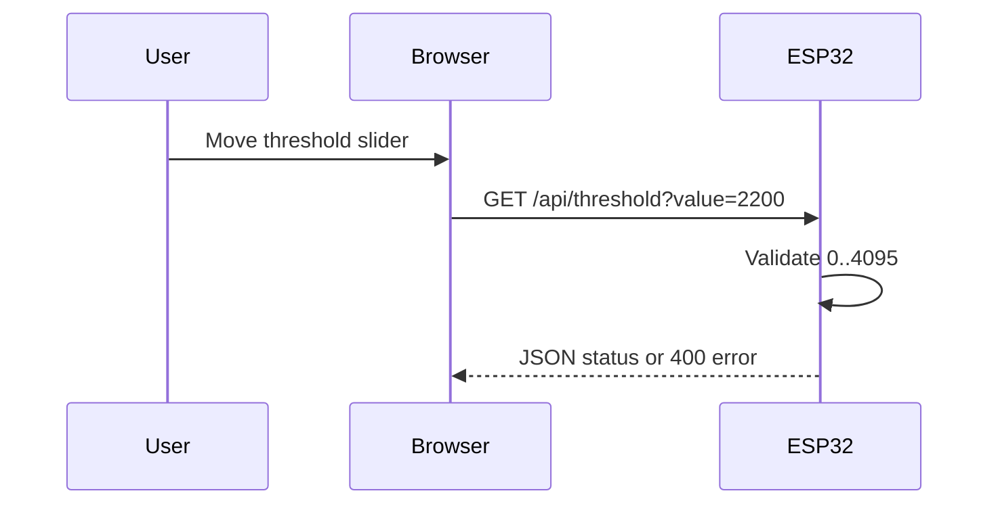

# Flow Overview

## Boot Flow

## Main Loop Flow

## Dashboard Refresh Flow

## Manual Lamp Control Flow

## Threshold Update Flow

## Clap Detection Rules

1. Baca nilai analog KY-037 dari GPIO34.
2. Jika nilai analog lebih kecil dari threshold, sistem rearm untuk trigger berikutnya.
3. Jika nilai analog mencapai threshold dan clap mode aktif, cek cooldown.
4. Jika cooldown sudah lewat, toggle lampu.
5. Setelah trigger, sistem disarm sampai nilai analog turun lagi.

## Output Polarity Note

LED 5V dengan transistor NPN memakai aktif HIGH: ON menulis `HIGH`, OFF menulis `LOW`. Flow dashboard, API, threshold, dan clap detection tetap sama; mapping output fisik GPIO26 mengikuti transistor switch.
